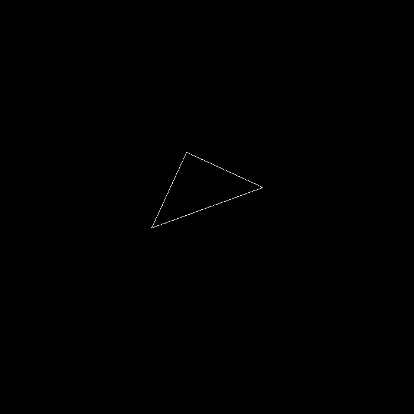
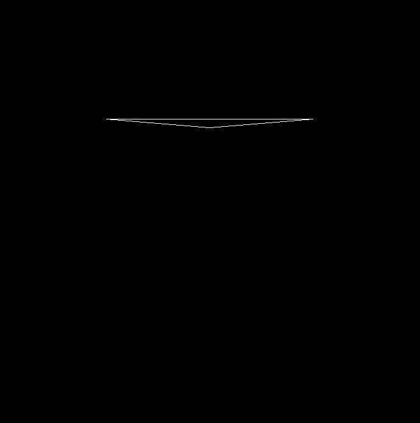
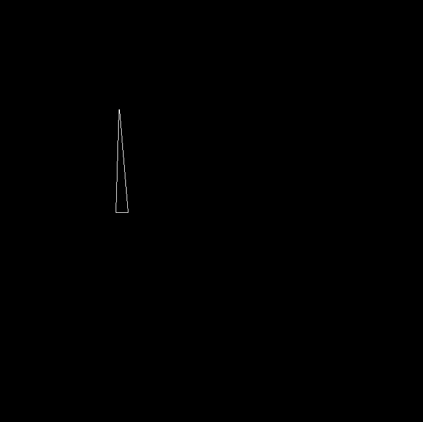
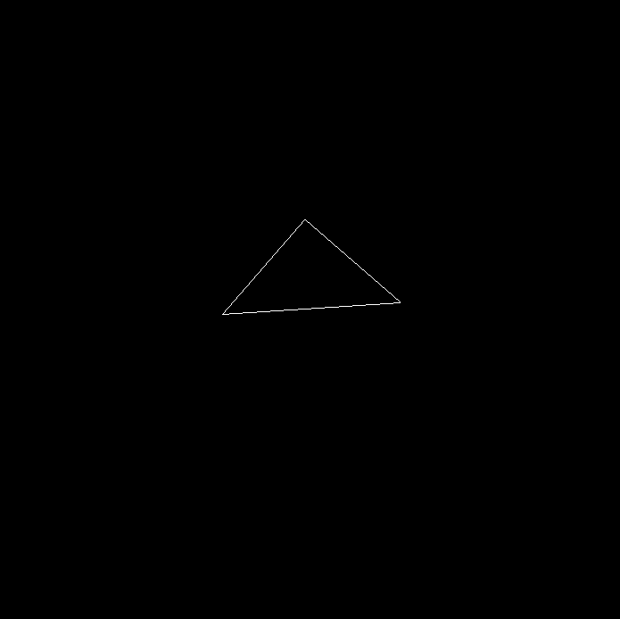

## Homework 1

给定三维下三个点`v0(2.0,0.0,-2.0)`,`v1(0.0,2.0,-2.0)`,`v2(-2.0,0.0,-2.0)`,
需要将这三个点的坐标变换为屏幕坐标, 并在屏幕上绘制出对应的线框三角形
(在代码框架中已经提供了`draw_triangle`函数，所以只需要去构建变换矩阵即可)。

## How to Run

```bash
mkdir build
cd build
cmake ..
make -j4
./Rasterizer
```

## Args

- `-r`: set the rotation and output a image.

```
./Rasterizer -r 20 output.png
```



- `-axis`: set the axis of rotation.

```
./Rasterizer -axis x
```



```
./Rasterizer -axis y
```



```
./Rasterizer -axis z
```

