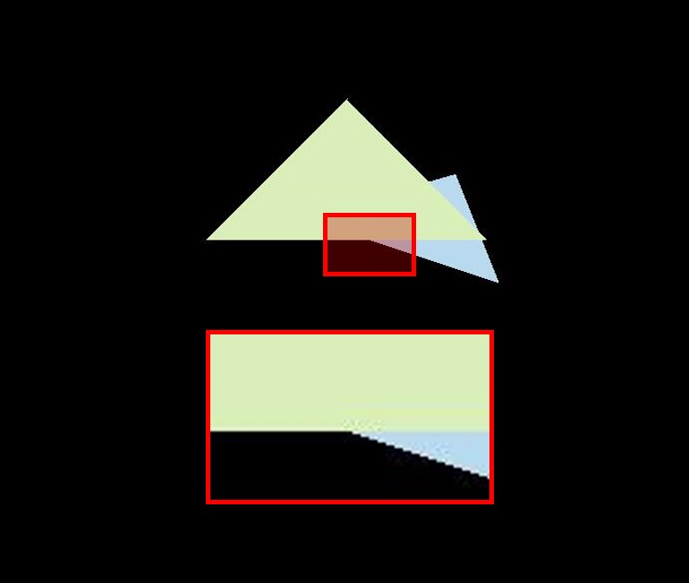
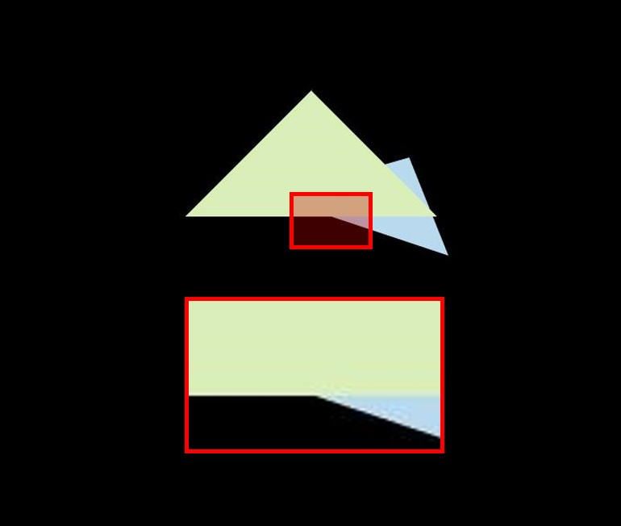

## Homework 2

在屏幕上画出一个实心三角形， 换言之，栅格化一个三角形。
用 super-sampling 处理 Anti-aliasing 。

## How to Run

```bash
mkdir build
cd build
cmake ..
make -j4
./Rasterizer
```

## Args

- default: no ssaa.

```
./Rasterizer
```



- `-ssaa`: open ssaa.

```
./Rasterizer -ssaa
```

