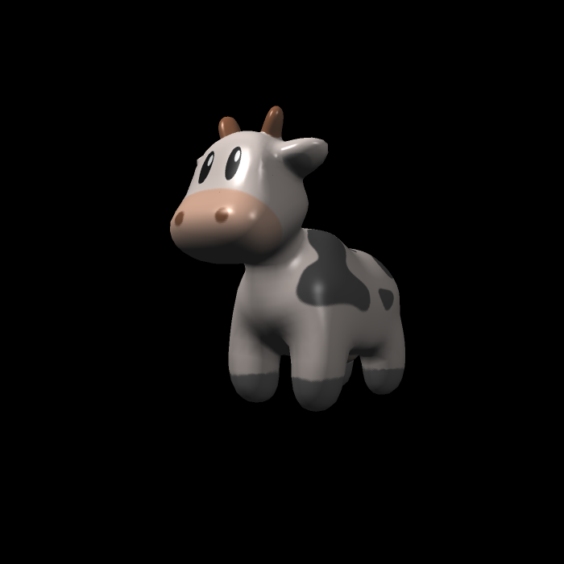
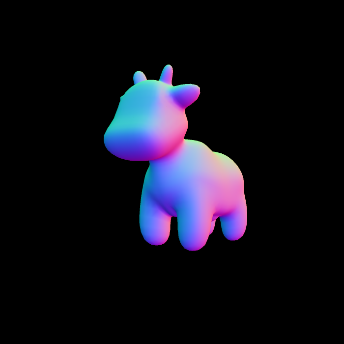
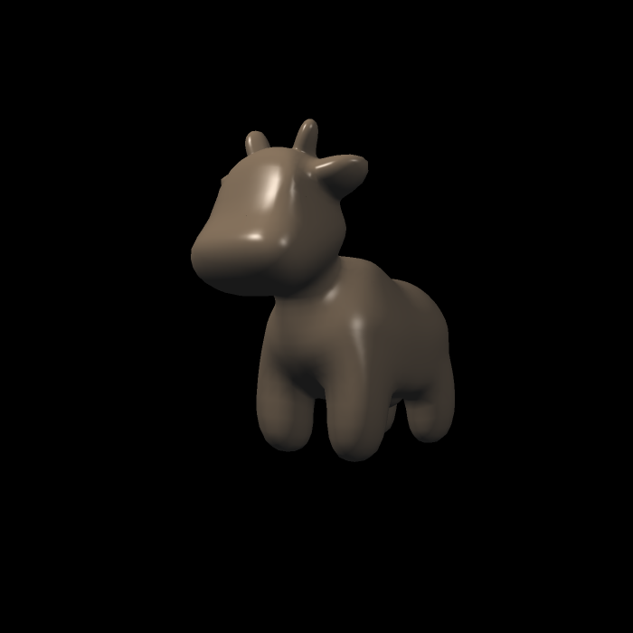
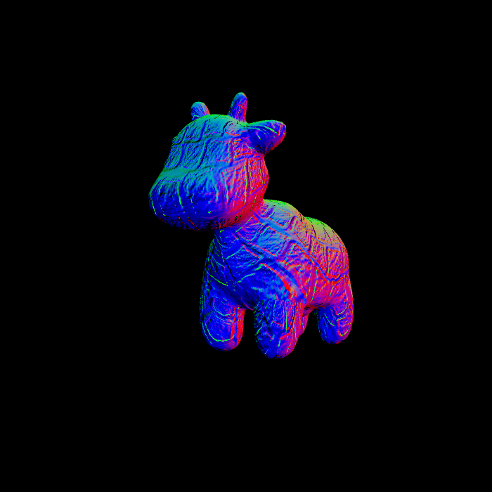
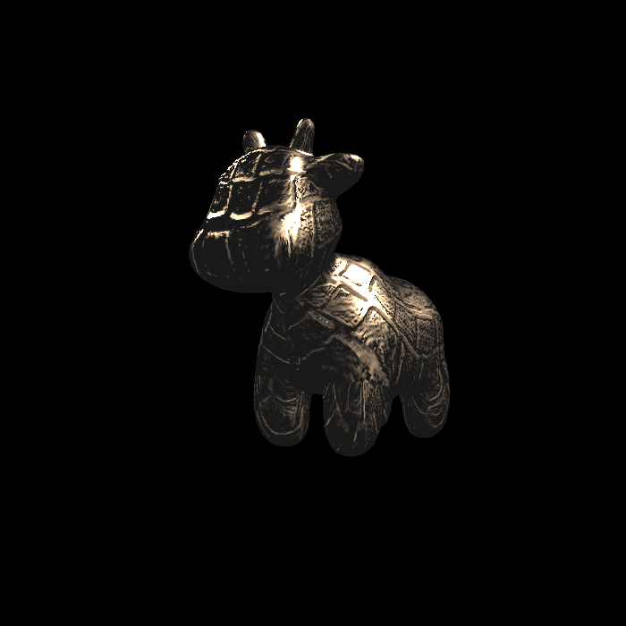

## Homework 3

- 实现与作业2类似的插值算法，实现法向量、颜色、纹理颜色的插值;
- 实现 Blinn-Phong 模型;
- 实现 Texture Shading Fragment Shader;
- 实现 Bump mapping;
- 实现 displacement mapping;
- 默认在其中实现了作业2中的SSAA。

## How to Run

```bash
mkdir build
cd build
cmake ..
make -j4
./Rasterizer output.png <model>
```

## Args

```
./Rasterizer texture.png texture
```



```
./Rasterizer normal.png normal
```



```
./Rasterizer phong.png phong
```




```
./Rasterizer bump.png bump
```



```
./Rasterizer displacement.png displacement
```



## Bilinear Color

使用256分辨率的贴图进行对比.

origin:


bilinear:


