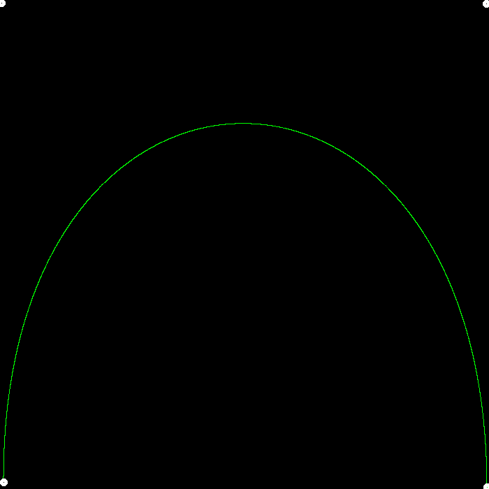
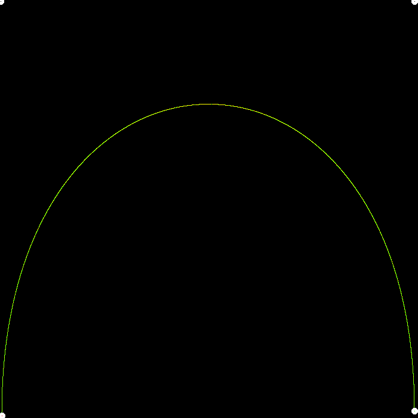
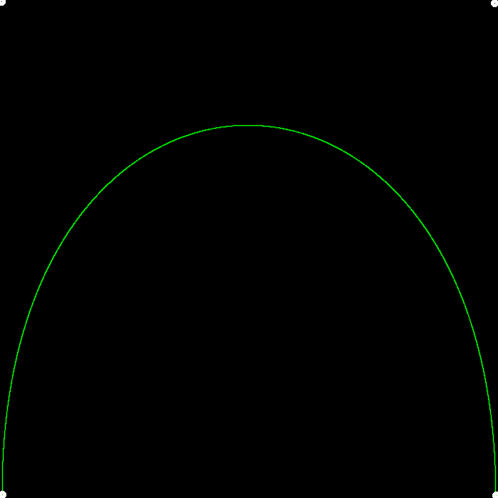

## Homework 4

- 实现 de Casteljau 算法来绘制由 4 个控制点表示的 Bézier 曲线;
- 实现对 Bézier 曲线的反走样。

## How to Run

```bash
mkdir build
cd build
cmake ..
make -j4
./BezierCurve
```

## Results

- `bezier`



- `bezier + naive_bezier`



- `bezier_anti_aliasing`

