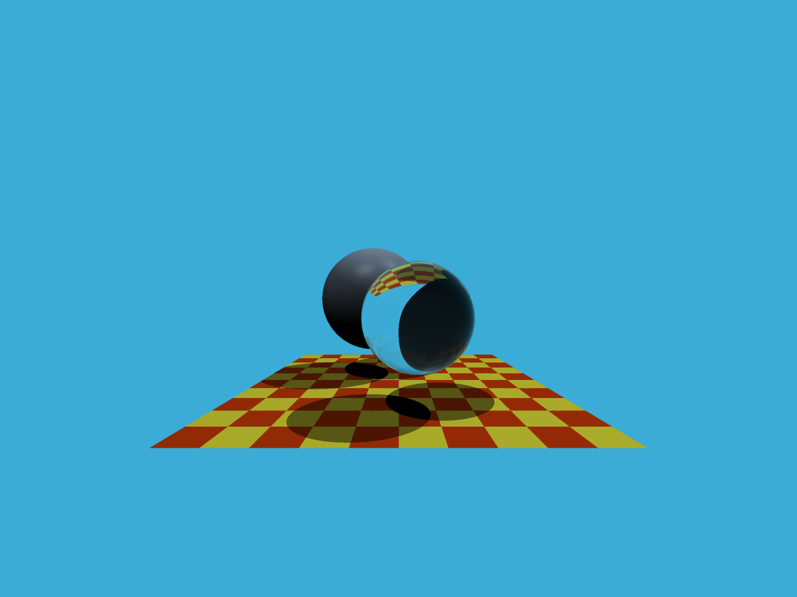

## Homework 5

- 为每个像素生成一条对应的光线，然后调用函数 castRay() 来得到颜色，最后将颜色存储在帧缓冲区的相应像素中。
- 实现 Moller-Trumbore 算法来更新的参数;
- 默认在其中实现了作业2中的SSAA。

## How to Run

```bash
mkdir build
cd build
cmake ..
make -j4
./Raytracing
```

## Results

- `ray tracing normal`


- `ray tracing ssaa`

