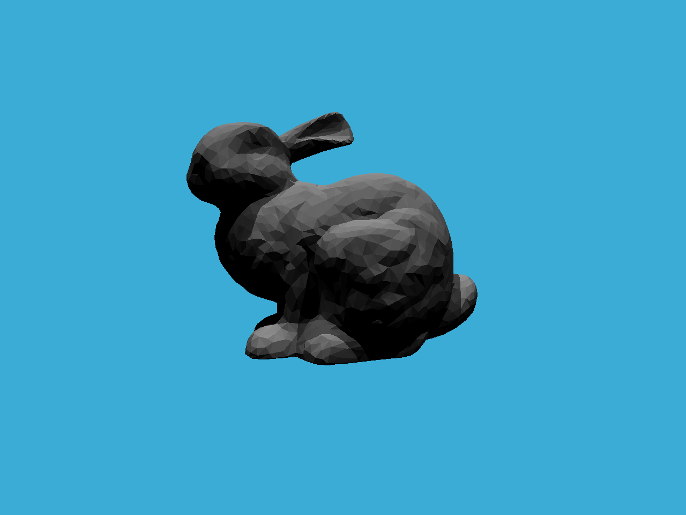

## Homework 6

- 判断包围盒 BoundingBox 与光线是否相交;
- 利用BVH加速求交过程，递归实现求交的过程;
- 实现 SAH(Surface Area Heuristic) 加速。

## How to Run

```bash
mkdir build
cd build
cmake ..
make -j4
./Raytracing
```

## Results

- `BVH`: time cost 4892 ms;

```bash
./Raytracing
```



- `SAH`: time cost 4088 ms;

```bash
./Raytracing SAH
```


