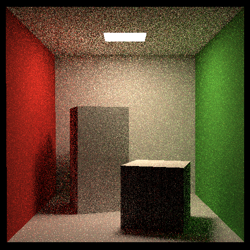

## Homework 7

- 实现完整的Path Tracing算法;
- 实现多线程进一步加快运算(有点Bug会随机地导致Core Dump，暂时不修了);
- Mirofacet暂时未实现.

## How to Run

```bash
mkdir build
cd build
cmake ..
make -j4
./Raytracing
```

## Results

- `SSP`=`8`, `Resolution`=`512x512`


