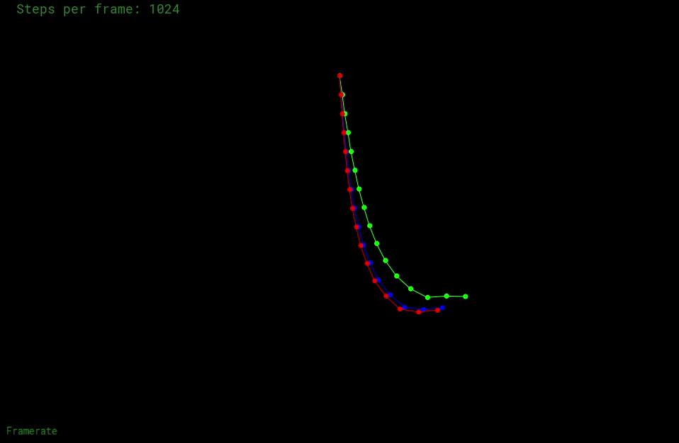
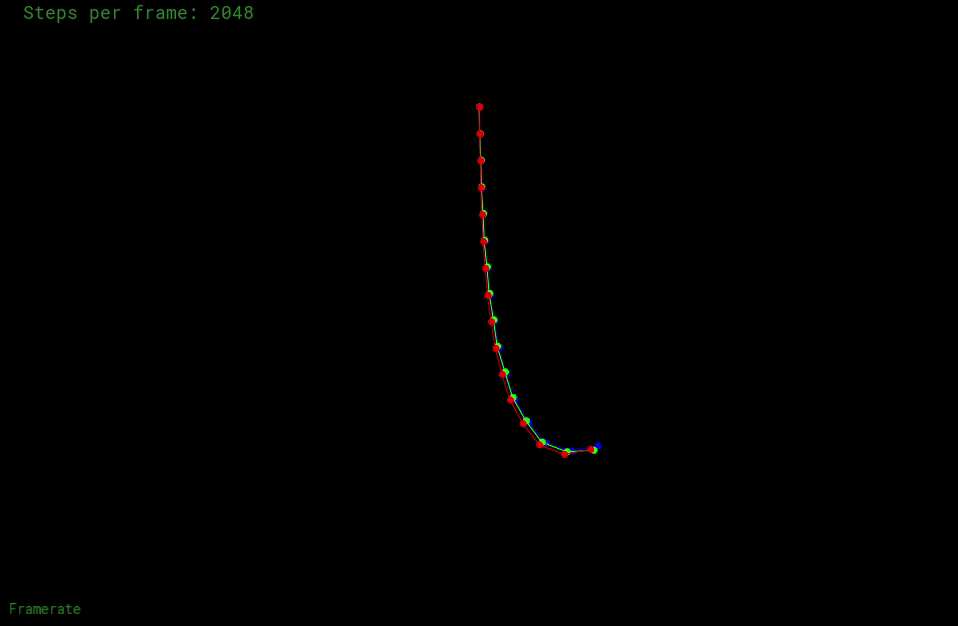
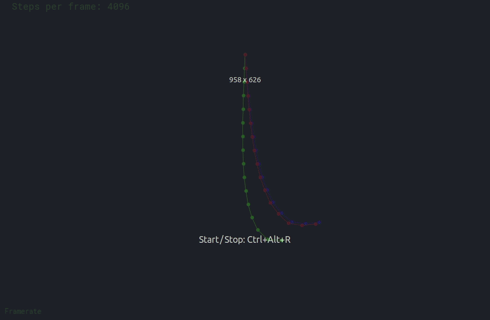

## Homework 8

- 绳子约束，正确的构造绳子;
- 半隐式欧拉法;
- 显式欧拉法;
- 显式Verlet;

## How to Run

```bash
mkdir build
cd build
cmake ..
make -j4
./ropesim -s 1024
```

## Results

- `stepbyframe=1024`



- `stepbyframe=2048`



- `stepbyframe=4096`

